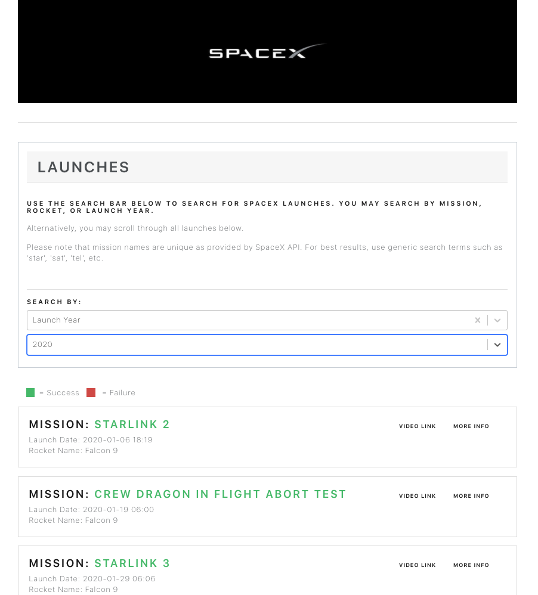

# GraphQL for SpaceX Launches

This application wraps SpaceX's REST API with a GraphQL API layer in order to return requested data to a React client.

## Technologies

- [React](https://reactjs.org/docs/getting-started.html)
- [Node](https://nodejs.org/en/) / [Express](https://expressjs.com/en/starter/installing.html)
- [GraphQL](https://www.howtographql.com/graphql-js/1-getting-started/)

# Getting Started

#### Step 1: Clone this repo or a forked version to your local computer

In your terminal, navigate to the directory in which you wish to place this folder

```bash
git clone https://github.com/JsonRoyJones/spacex-app-evgo
```
(note that if you forked this repo, you'll want to swap my username out for your username instead)

## Get up and running (locally)

1. Have [Node](https://nodejs.org/en/download/) and NPM installed locally:

   - Verify with `node -v` and `npm -v` respectively.

1. Install the node packages needed in each directory:

   - `cd spacex-app-evgo` and run `npm install`
   - `cd client` and run `npm install`
   - start the server and the client app in development mode by running `npm run dev` from the project's root directory

You should now have a live app. Navigate to http://localhost:3000/ to access the web app.

You can also interact with the GraphQL server at http://localhost:5000/graphql

If you encounter any errors, please don't hesitate to reach out to me at jasonroyjones@gmail.com


